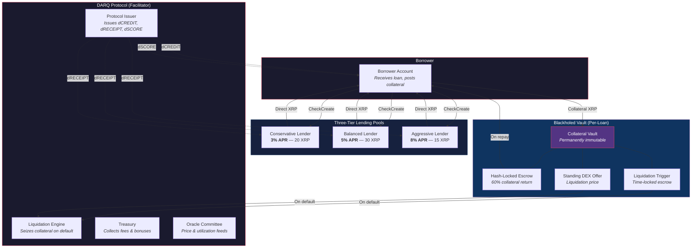
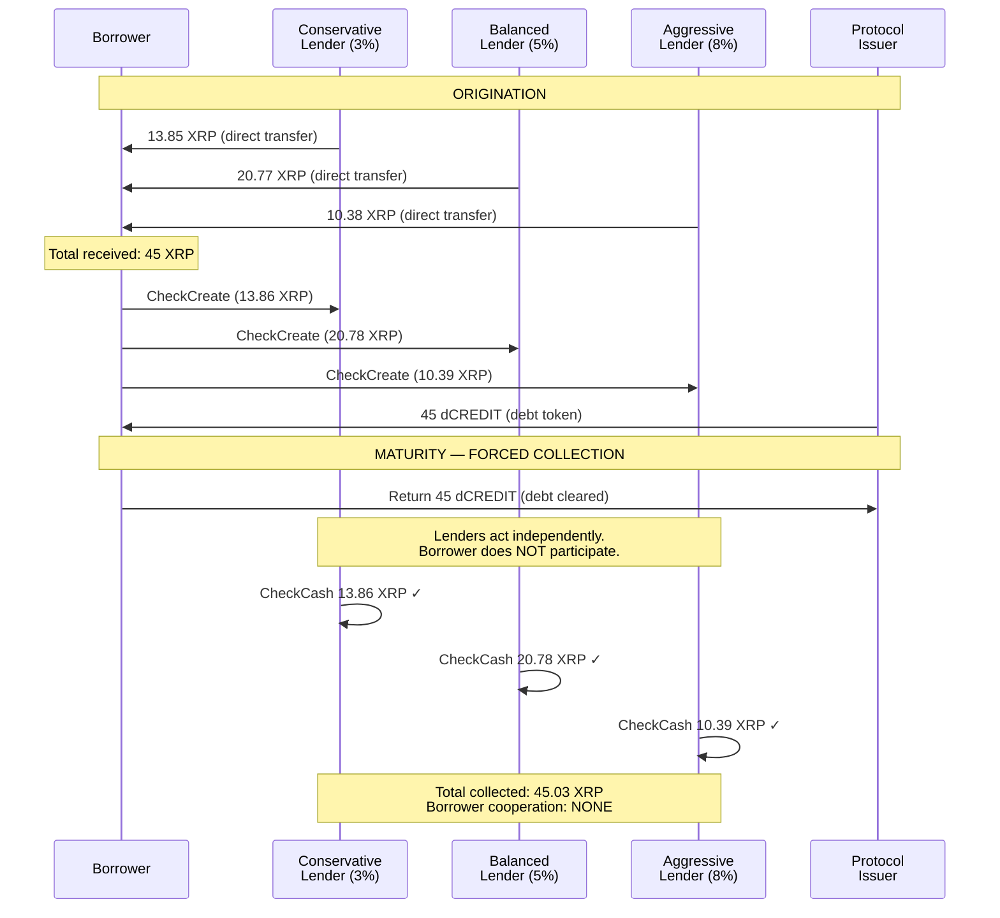
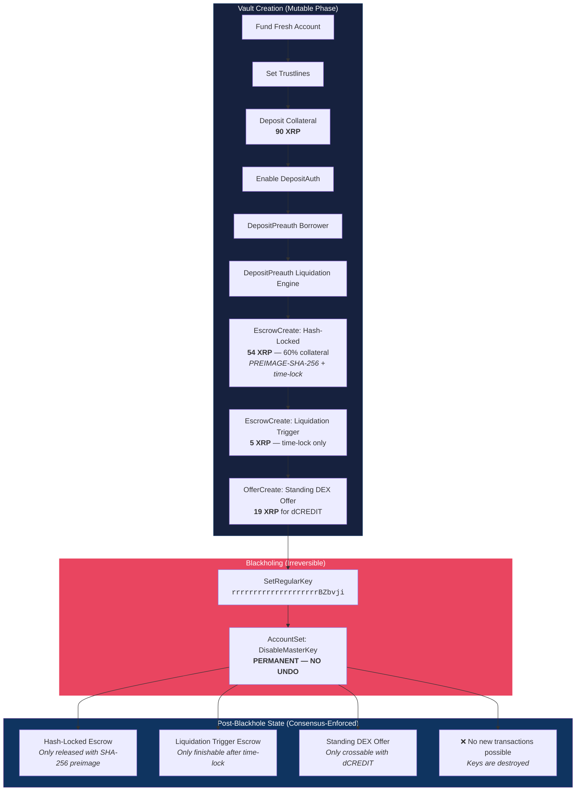
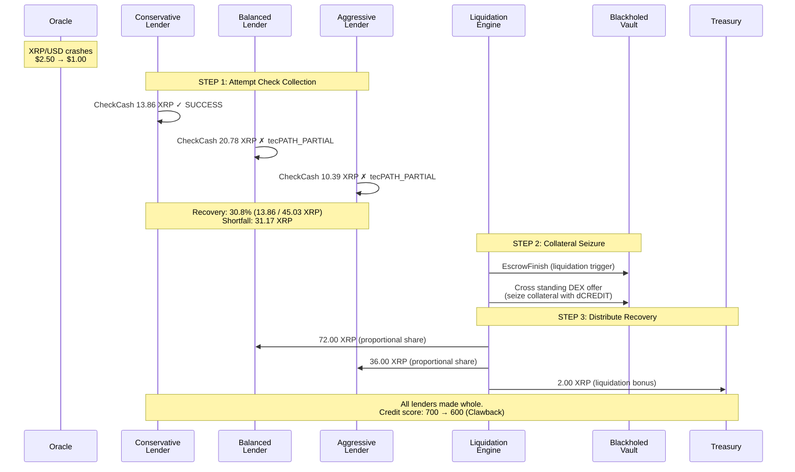
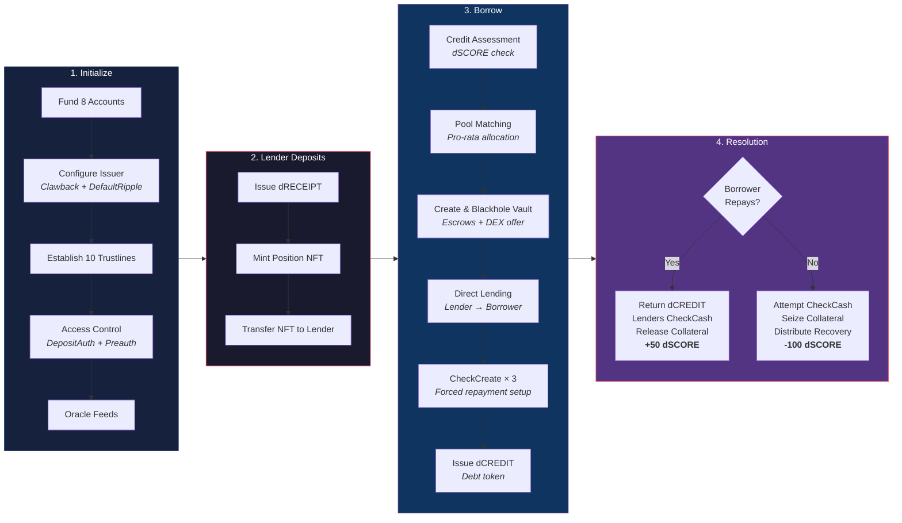

# DARQ Credit Protocol v2

**Facilitator Architecture — P2P Credit Lending on XRPL**

A peer-to-peer credit lending marketplace built entirely from native XRPL transaction primitives. The protocol matches borrowers with lenders, orchestrates transaction flows, and monitors for defaults — but never holds or intermediates capital. All funds flow directly between participants.

```
                    ┌─────────────────────────┐
                    │   DARQ Credit Protocol   │
                    │                         │
                    │   Holds: ZERO capital    │
                    │   Role:  Matchmaker      │
                    │   Risk:  Non-custodial   │
                    └─────────────────────────┘
```

---

## Protocol Architecture



---

## Financial Engineering

### The Core Mechanism: CheckCreate/CheckCash

XRPL Checks are pre-authorized payment pulls. The borrower signs a `CheckCreate` at loan origination, granting each lender the right to pull their proportional repayment at any time. The borrower does not participate in the collection — the lender calls `CheckCash` unilaterally.

This inverts the trust model: instead of trusting borrowers to repay voluntarily, lenders hold an irrevocable authorization to collect.



### Three-Tier Weighted Average Pricing

Loans are filled pro-rata across three risk-tiered pools. Each lender contributes proportionally to their available balance, producing a blended interest rate:

```
Weighted Rate = Σ(Lender_Amount × Lender_Rate) / Total_Loan

Example — 45 XRP loan:
  Conservative: 13.85 XRP × 3.0% = 0.4155
  Balanced:     20.77 XRP × 5.0% = 1.0385
  Aggressive:   10.38 XRP × 8.0% = 0.8304
                                    ──────
  Weighted Rate = 2.2844 / 45 = 5.08% blended APR
```

Each lender receives their own isolated Check. No commingling, no shared pool risk. The conservative lender's 3% return is unaffected by whether the aggressive lender's 8% position performs.

### Blackholed Vault — Immutable Collateral Custody



After blackholing, no human, key, or protocol upgrade can alter the vault. The pre-programmed escrows and offers execute according to their conditions — enforced by XRPL consensus, not by trust.

### Dual-Enforcement Collateral Release

Collateral return requires two independent verifications:

1. **Application layer**: Borrower's `dCREDIT` balance must equal zero (all debt tokens returned to protocol issuer, verifiable via `account_lines`)
2. **Consensus layer**: Borrower must reveal the SHA-256 preimage that satisfies the escrow's cryptographic condition (`EscrowFinish` with `Fulfillment`)

The preimage is only revealed after on-chain debt clearance is confirmed. Neither condition alone is sufficient.

### Liquidation: Graceful Degradation



When CheckCash fails (`tecPATH_PARTIAL` — borrower drained account), the protocol doesn't stop. It:

1. Records which Checks succeeded and which failed
2. Calculates the shortfall
3. Seizes collateral from the blackholed vault via the standing DEX offer
4. Distributes recovered XRP proportionally to underpaid lenders
5. Penalizes the borrower's credit score via `Clawback` (-100 dSCORE)

---

## Token System

| Token | Encoding | Purpose |
|-------|----------|---------|
| **dCREDIT** | `6443524544495400000000000000000000000000` | Debt obligation. Issued at origination, returned at repayment. Non-zero balance = outstanding debt. |
| **dRECEIPT** | `6452454345495054000000000000000000000000` | Lender deposit receipt. 1:1 for each XRP committed. Proves lending position. |
| **dSCORE** | `6453434F52450000000000000000000000000000` | On-chain credit score. Starts at 700. +50 on-time repay. -100 (Clawback) on liquidation. |

All tokens are issued by the Protocol Issuer with `asfAllowTrustLineClawback` enabled, allowing the protocol to enforce credit penalties.

---

## Complete Lifecycle Flow



---

## Transaction Primitives

Every operation uses native XRPL transaction types. No smart contracts, no VM, no external dependencies.

| Primitive | Protocol Usage |
|-----------|---------------|
| `CheckCreate` / `CheckCash` | Forced repayment — lenders pull without borrower |
| `EscrowCreate` + `PREIMAGE-SHA-256` | Hash-locked collateral return |
| `EscrowCreate` (time-locked) | Liquidation trigger mechanism |
| `EscrowFinish` + `Fulfillment` | Collateral release with preimage reveal |
| `SetRegularKey` + `DisableMasterKey` | Permanent vault blackholing |
| `OfferCreate` | Standing liquidation DEX offer |
| `Clawback` | Credit score penalty enforcement |
| `DepositPreauth` | Access control on Treasury and vault |
| `NFTokenMint` / `NFTokenAcceptOffer` | Position records (Loan, Repayment, Liquidation) |
| `TrustSet` + `Payment` (tokens) | dCREDIT, dRECEIPT, dSCORE issuance |
| `OracleSet` | Price and utilization feeds |

---

## Running the Protocol

### Prerequisites

- Node.js v18+
- XRPL Testnet access (no API keys needed)

### Install

```bash
npm install
```

### Demo Modes

```bash
# Happy path: borrow → forced repayment → collateral release
node src/demo.js repay

# Default path: borrow → drain → partial check recovery → collateral seizure
node src/demo.js liquidate
```

### Step-by-Step Execution

```bash
node src/index.js init        # Fund accounts, configure trustlines
node src/index.js deposit     # Register 3 lenders across tiers
node src/index.js borrow      # Originate 45 XRP loan
node src/index.js repay       # Force-collect via Checks + release collateral
node src/index.js liquidate   # Attempt Checks + seize collateral
```

---

## Project Structure

```
├── package.json
├── src/
│   ├── config.js              # Constants, currency codes, pool tiers
│   ├── utils/
│   │   ├── tx.js              # submitTx(), ledger time, wait utilities
│   │   ├── state.js           # Balance queries, Check/NFT/Escrow lookups
│   │   ├── crypto.js          # PREIMAGE-SHA-256 condition generation
│   │   └── pools.js           # Pro-rata allocation, weighted average
│   ├── flows/
│   │   ├── initialize.js      # Fund 8 accounts, trustlines, access control
│   │   ├── deposit.js         # Register lenders, issue dRECEIPT + NFTs
│   │   ├── borrow.js          # Pool matching, vault, direct lending, Checks
│   │   ├── repay.js           # dCREDIT return, forced Check collection, escrow release
│   │   ├── liquidate.js       # Check attempts, collateral seizure, distribution
│   │   └── summary.js         # Final protocol state display
│   ├── index.js               # Step-by-step CLI runner
│   └── demo.js                # Full lifecycle: repay or liquidate mode
```

---

## Testnet Results

Both lifecycle modes verified on XRPL Testnet (`wss://s.altnet.rippletest.net:51233`):

**Repay Mode:**
- 3/3 CheckCash: `tesSUCCESS` (45.03 XRP collected, zero borrower cooperation)
- EscrowFinish with SHA-256 fulfillment: `tesSUCCESS` (54 XRP collateral released)
- Credit score: 700 → 750

**Liquidation Mode:**
- 1/3 CheckCash: `tesSUCCESS` (13.86 XRP), 2/3: `tecPATH_PARTIAL` (borrower drained)
- Collateral seized via DEX offer crossing: `tesSUCCESS`
- Recovered XRP distributed to unpaid lenders: `tesSUCCESS`
- Clawback 100 dSCORE: `tesSUCCESS` (700 → 600)

---

## Dependencies

```json
{
  "xrpl": "^4.2.0",
  "five-bells-condition": "^5.0.1"
}
```

---

## License

Copyright (c) 2026 DARQ Labs LLC. All rights reserved.

This software is proprietary and confidential. Unauthorized copying, distribution, modification, or use of this software, in whole or in part, is strictly prohibited without prior written permission from DARQ Labs.
