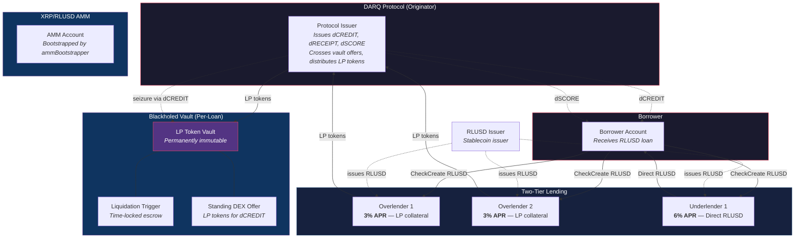
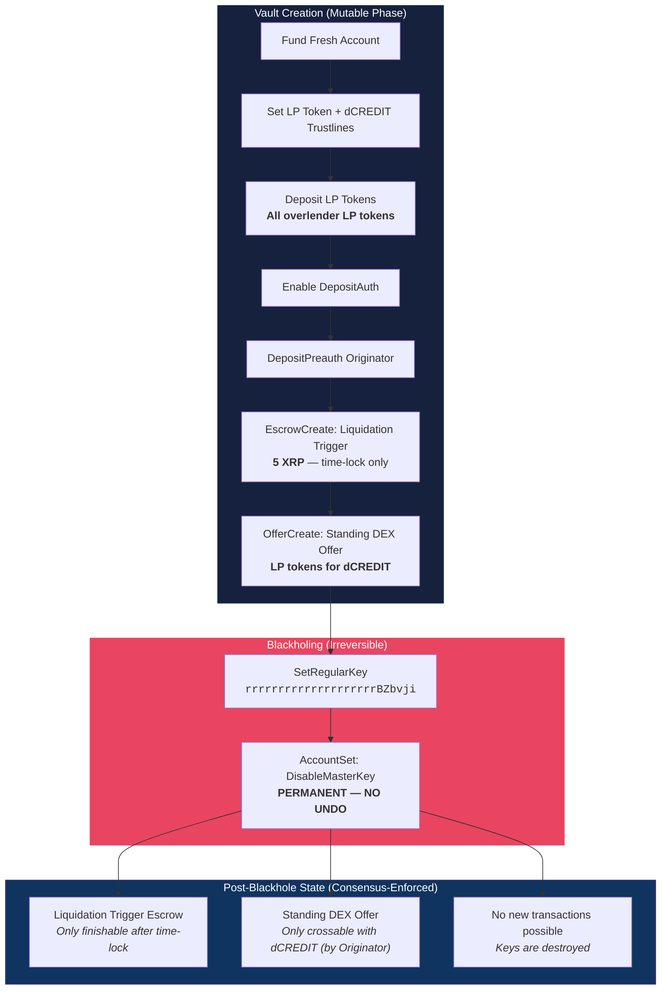
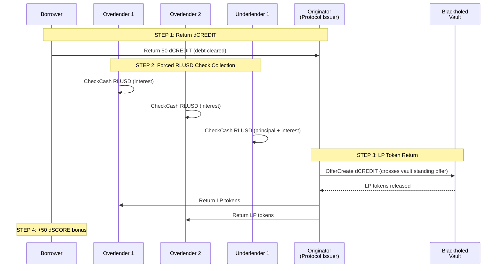
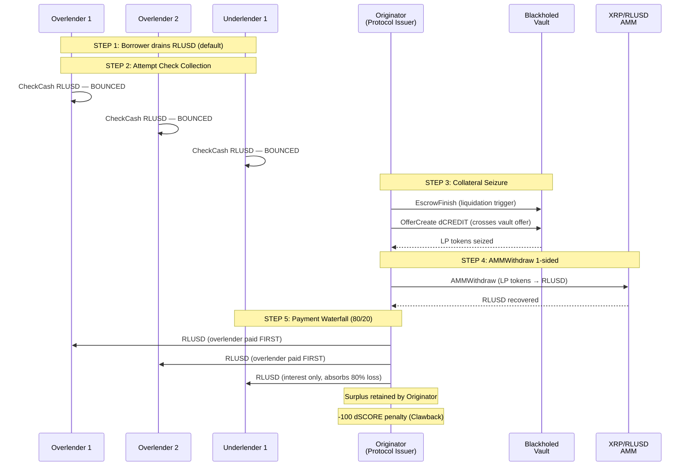
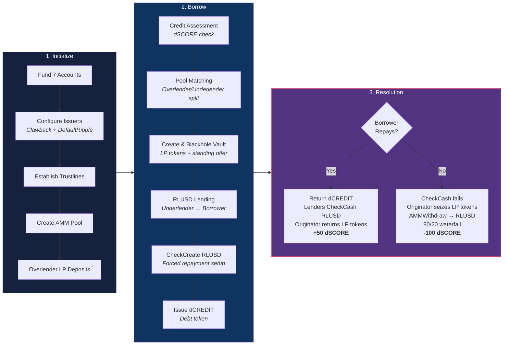

# DARQ Credit Protocol v3

**AMM-Backed Overlender Architecture — P2P Credit Lending on XRPL**

A peer-to-peer credit lending marketplace built entirely from native XRPL transaction primitives. The Originator (Protocol Issuer) matches borrowers with lenders, orchestrates transaction flows, and handles default recovery — but never intermediates capital. All funds flow directly between participants via RLUSD Checks.

```
                    ┌─────────────────────────┐
                    │   DARQ Credit Protocol   │
                    │                         │
                    │   Denomination: RLUSD    │
                    │   Role:  Originator      │
                    │   Accounts: 7            │
                    └─────────────────────────┘
```

---

## Protocol Architecture



---

## Financial Engineering

### The Core Mechanism: CheckCreate/CheckCash (RLUSD)

XRPL Checks are pre-authorized payment pulls. The borrower signs a `CheckCreate` at loan origination, granting each lender the right to pull their proportional RLUSD repayment at any time. The borrower does not participate in the collection — the lender calls `CheckCash` unilaterally.

This inverts the trust model: instead of trusting borrowers to repay voluntarily, lenders hold an irrevocable authorization to collect.

### Two-Tier Lending: Overlender + Underlender

Loans are backed by two tiers of capital:

- **Overlenders** deposit XRP + RLUSD into the AMM, receive LP tokens. These LP tokens serve as collateral locked in a blackholed vault.
- **Underlenders** provide direct RLUSD capital that flows to the borrower.

```
Weighted Rate = Σ(Lender_Amount × Lender_Rate) / Total_Loan

Example — 50 RLUSD loan:
  Overlender 1:   12.50 RLUSD backing × 3.0% = 0.375
  Overlender 2:   12.50 RLUSD backing × 3.0% = 0.375
  Underlender 1:  25.00 RLUSD capital  × 6.0% = 1.500
                                                ──────
  Weighted Rate = 2.250 / 50 = 4.50% blended APR
```

### Blackholed Vault — Immutable LP Token Custody



After blackholing, no human, key, or protocol upgrade can alter the vault. The pre-programmed escrow and offer execute according to their conditions — enforced by XRPL consensus, not by trust.

### Repayment: Forced RLUSD Collection + LP Token Return



### Liquidation: Default Recovery via AMM



### Payment Waterfall (Default Split)

```
                    ┌─────────────────────────┐
                    │   RLUSD Recovered (AMM)  │
                    └────────────┬────────────┘
                                 │
                    ┌────────────▼────────────┐
                    │   Tier 1: OVERLENDER    │
                    │   Paid FIRST            │
                    │   Absorbs 20% of loss   │
                    └────────────┬────────────┘
                                 │
                    ┌────────────▼────────────┐
                    │   Tier 2: UNDERLENDER   │
                    │   Interest only          │
                    │   Absorbs 80% of loss   │
                    └────────────┬────────────┘
                                 │
                    ┌────────────▼────────────┐
                    │   Tier 3: SURPLUS       │
                    │   Retained by Originator │
                    └─────────────────────────┘
```

---

## Account Architecture

| Account | Role | Count |
|---------|------|-------|
| **Protocol Issuer** | Originator — issues dCREDIT/dRECEIPT/dSCORE, crosses vault offers, distributes LP tokens, handles waterfall | 1 |
| **RLUSD Issuer** | Stablecoin issuer (separate from protocol) | 1 |
| **AMM Bootstrapper** | Seeds the initial XRP/RLUSD AMM pool | 1 |
| **Overlender 1 & 2** | Deposit into AMM, receive LP tokens as collateral | 2 |
| **Underlender 1** | Provides direct RLUSD capital | 1 |
| **Borrower** | Receives RLUSD loan, signs RLUSD Checks | 1 |
| | **Total** | **7** |

---

## Token System

| Token | Encoding | Purpose |
|-------|----------|---------|
| **dCREDIT** | `6443524544495400000000000000000000000000` | Debt obligation. Issued at origination, returned at repayment. Also used as vault crossing key. |
| **dRECEIPT** | `6452454345495054000000000000000000000000` | Lender deposit receipt. Proves lending position. |
| **dSCORE** | `6453434F52450000000000000000000000000000` | On-chain credit score. Starts at 700. +50 on-time repay. -100 (Clawback) on liquidation. |

All tokens are issued by the Protocol Issuer with `asfAllowTrustLineClawback` enabled.

---

## Complete Lifecycle Flow



---

## Transaction Primitives

Every operation uses native XRPL transaction types. No smart contracts, no VM, no external dependencies.

| Primitive | Protocol Usage |
|-----------|---------------|
| `CheckCreate` / `CheckCash` | Forced repayment — lenders pull RLUSD without borrower |
| `EscrowCreate` (time-locked) | Liquidation trigger mechanism |
| `EscrowFinish` | Liquidation trigger release |
| `SetRegularKey` + `DisableMasterKey` | Permanent vault blackholing |
| `OfferCreate` | Standing vault offer (LP tokens for dCREDIT) |
| `AMMCreate` / `AMMDeposit` / `AMMWithdraw` | LP token pool management |
| `Clawback` | Credit score penalty enforcement |
| `DepositPreauth` | Access control on vault |
| `NFTokenMint` / `NFTokenAcceptOffer` | Position records (Loan, Repayment, Liquidation) |
| `TrustSet` + `Payment` (tokens) | dCREDIT, dRECEIPT, dSCORE, RLUSD issuance |

---

## Running the Protocol

### Prerequisites

- Node.js v18+
- XRPL Testnet access (no API keys needed)

### Install

```bash
npm install
```

### Demo Modes

```bash
# Happy path: borrow → forced RLUSD repayment → LP token return
npm run demo:repay

# Default path: borrow → drain → RLUSD Checks bounce → LP seizure → AMM withdrawal → 80/20 waterfall
npm run demo:liquidate
```

---

## Project Structure

```
├── package.json
├── src/
│   ├── config.js              # Constants, currency codes, AMM config, 7 accounts
│   ├── utils/
│   │   ├── tx.js              # submitTx(), ledger time, wait utilities
│   │   ├── state.js           # Balance queries, Check/NFT/Escrow lookups
│   │   ├── crypto.js          # PREIMAGE-SHA-256 condition generation
│   │   ├── amm.js             # AMM create, deposit, withdraw, LP balance
│   │   └── pools.js           # Overlender/underlender allocation
│   ├── flows/
│   │   ├── initialize.js      # Fund 7 accounts, trustlines, AMM, LP deposits
│   │   ├── borrow.js          # Pool matching, vault, RLUSD lending, Checks
│   │   ├── repay.js           # dCREDIT return, forced Check collection, LP return
│   │   ├── liquidate.js       # Check attempts, LP seizure, AMMWithdraw, waterfall
│   │   └── summary.js         # Final protocol state display
│   ├── index.js               # Step-by-step CLI runner
│   └── demo.js                # Full lifecycle: repay or liquidate mode
```

---

## Testnet Results

Both lifecycle modes verified on XRPL Testnet (`wss://s.altnet.rippletest.net:51233`):

**Repay Mode:**
- All CheckCash: `tesSUCCESS` (RLUSD collected, zero borrower cooperation)
- LP tokens returned via vault standing offer crossing: `tesSUCCESS`
- Credit score: 700 → 750

**Liquidation Mode:**
- All CheckCash: `tecPATH_PARTIAL` (borrower drained RLUSD)
- LP tokens seized via standing offer: `tesSUCCESS`
- AMMWithdraw 1-sided: `tesSUCCESS` (LP tokens → RLUSD)
- Waterfall distribution: `tesSUCCESS` (overlender first, then underlender)
- Clawback 100 dSCORE: `tesSUCCESS` (700 → 600)

---

## Dependencies

```json
{
  "xrpl": "^4.2.0",
  "five-bells-condition": "^5.0.1"
}
```

---

## License

Copyright (c) 2026 DARQ Labs LLC. All rights reserved.

This software is proprietary and confidential. Unauthorized copying, distribution, modification, or use of this software, in whole or in part, is strictly prohibited without prior written permission from DARQ Labs.
